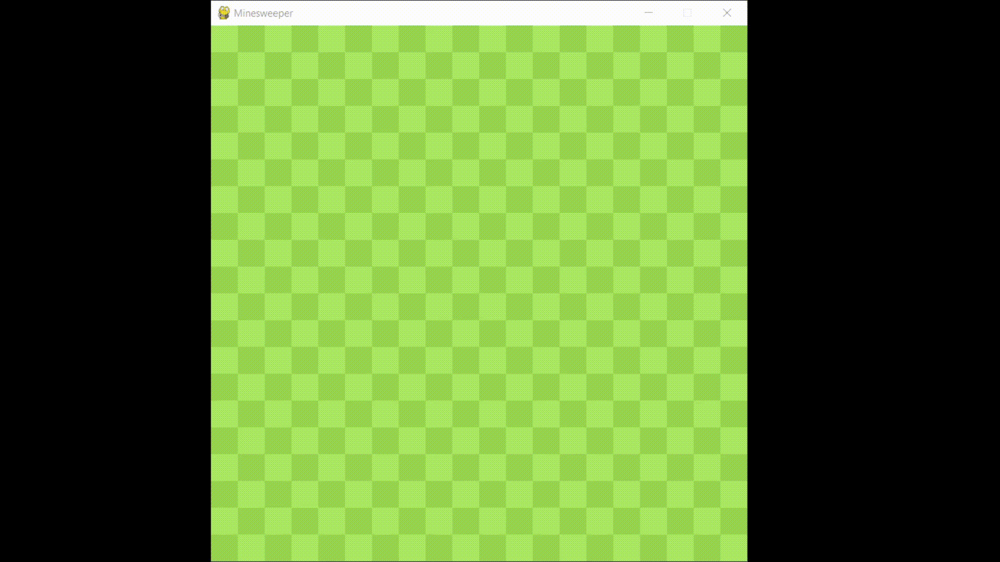

# Minesweeper Clone

Clone of google's minesweeper game using python and the pygame library.

## How to run

1. Make sure you have the [pygame](https://pypi.org/project/pygame/) library installed
2. Open and run `minesweeper.py`

## Features

#### Flagging

You can flag tiles that you think contain mines to prevent accidentally clicking them.

#### Automatic Clearing

Using the the mousewheel button on a cleared tile will if clear neighbouring tiles if the possible mine locations are marked with flags.

#### Dynamic Mine Generation

The game mine generation algorithm garantees that the first tile clear will result in a cleared zone.
